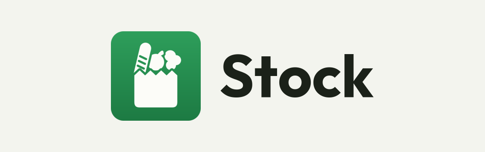

<p align="center">
  
</p>

Household pantry tracker for two people: what is in the house, how much is left,
what needs buying, and a fortnightly meal plan that feeds the shopping list. A
SwiftUI iOS app for the checks you do standing in front of the fridge, a Next.js
web app for what you sit down to do on a Friday, both talking straight to
Firebase with no server in between — and **$0 of infrastructure, which is the
constraint behind almost every decision below**.

|  |  |
| --- | --- |
| 📱 `apps/ios` | SwiftUI app, iOS 17+, with a widget and a watchOS companion. Barcode scanning, expiry notifications. |
| 🌐 `apps/web` | Next.js App Router, fully client-rendered, an installable PWA. Where the week gets planned. |
| 🔥 `firebase` | Security rules, indexes, emulator config, and the rules tests. The rules are the only security boundary. |
| 🤝 `shared` | The cross-platform contract: the Firestore schema, the seed taxonomies, and the vectors both platforms run. |
| 🧰 `tools` | Seeding the emulators, sideloading onto the phone, rebuilding the icons and this banner. |
| 📐 `kyber` | Submodule: the tooling and the rules shared with the sibling apps. |
| 📚 `docs` | The plan, the design system, the setup, and the rules with their reasoning. |

## What it does

Three questions, in the order they get asked:

1. **What do we have?** A catalogue of everything the household keeps in stock —
   food, cleaning, toiletries — each with a quantity, a location (fridge /
   freezer / pantry / …) and a reorder minimum.
2. **What are we eating?** Recipes live in the app, and every Friday the next
   week or fortnight gets planned: one meal per day, picked from the recipes.
   Marking a meal as cooked offers to subtract its ingredients from stock.
3. **What has to be bought?** One shared shopping list, live on both phones.
   The app suggests what to put on it — items at or below their minimum, and
   ingredients the planned meals need but the house doesn't have — and one tap
   adds the lot. From there the list is yours: add anything, tick things off as
   you walk the aisles (ticked = struck through, still visible so nobody buys it
   twice), and when the shop is done, close it: everything ticked goes into
   stock in one pass and leaves the list. Whatever the supermarket didn't have
   stays on for next week.

Everything is shared between the two members of the household: both see the same
stock, the same plan and the same list, in real time.

### How quantities work

Weighing flour is not a thing anyone sustains, so **each item picks how it's
measured**:

- **Counted** — an integer quantity in `unit`, `g` or `ml`, with a minimum.
  `Huevos: 8 u (mín. 6)`. This is what makes an exact shortfall computable.
- **Level** — `vacío / poco / medio / lleno`, for staples nobody measures:
  salt, oil, flour, dish soap. No arithmetic, just a four-step dial.
- **Level + reserve** — the same dial, plus a count of the SEALED containers
  behind the open one and how many of those to keep. Detergent is the case:
  half a bottle in use and two unopened under the sink. Opening one drops the
  reserve to one, which is below the minimum, so it goes on the list right then
  — not weeks later when the last bottle runs dry. The dial measures what is
  open; the counter measures what is closed.

Recipes can only compute a numeric shortfall against counted items, with one
exception: an item with a reserve HAS a number — how many sealed ones it is
short of its minimum. When a
planned meal needs a level-tracked item that sits at `poco` or `vacío`, the item
goes on the list with the meal as its reason — no invented numbers.

## Quick start

```sh
pnpm install
pnpm emulators      # Auth 9280, Firestore 8280, UI 4280
pnpm seed           # a household that looks real, in the emulator
NEXT_PUBLIC_USE_EMULATORS=1 pnpm dev      # then use the "Emulador" sign-in buttons
pnpm test           # domain vectors + Firestore rules (needs Java)
```

iOS, against the same emulators:

```sh
cd apps/ios && xcodegen && open Stock.xcodeproj
xcodebuild test -project Stock.xcodeproj -scheme Stock \
  -destination 'platform=iOS Simulator,name=iPhone 17' -only-testing:StockTests
# Launch straight into a screen, signed in, no Google account needed:
xcrun simctl launch booted dev.cardozo.stock -useEmulators -devSignIn -tab falta
```

One-time console setup (Firebase project, Vercel, domain): [`docs/setup.md`](docs/setup.md).

## Key invariants

- **Quantities are integers** in the item's own unit (`unit`, `g`, `ml`). No
  floats — same reasoning as money in cents. Display formatting (`1,2 kg`) is a
  client concern.
- **Dates are `"YYYY-MM-DD"` strings in the household timezone** (stored on the
  household doc, default `Australia/Sydney`) — never the device's, never UTC
  bucketing. A meal planned for Wednesday is Wednesday in Sydney.
- **One item, one row.** Expiry is a single date on the item — the soonest one
  you care about — not a batch ledger. Two milks with different dates is not
  worth the modelling cost for a two-person household.
- **Firestore security rules are the security boundary.** Client-side gating is
  cosmetic; client config is public by design.
- **Bounded reads.** The catalogue (~150 docs) and the shopping list (~30) are
  bounded by nature, so both are listened to whole — that live listener is what
  makes two people ticking in the same supermarket work. `moves` grows forever
  and is therefore always paged with `limit()` via `getDocs`, never a live
  listener. In React, always return the unsubscribe from `useEffect`.
- **Google Sign-In only**, on both platforms — mixing providers creates two
  Firebase UIDs for the same person, and the household caps at 2.
- Logic duplicated across Swift and TypeScript must pass the shared vectors in
  `shared/` (plan period arithmetic, shopping-list derivation). Change the
  vectors first.
- **Source code and comments in English**; the UI is Spanish only.
- MIT license.

## Screens

Spanish UI. iOS is the one used on the move; web is the one used sitting down.
The two share the same data and most of the same views, deliberately: the
difference is what each is optimised for, not what each can do.

### Web (`stock.cardozo.dev`)

| Screen | What it's for |
|---|---|
| **Stock** (home) | The catalogue. Search, filter by location and category, status chips (`Falta`, `Poco`, `Vence pronto`). Inline `+ / −` on quantity, level dial for the rest. Add item. |
| **Falta comprar** | The shared list, grouped by category, with a suggestions panel below it (`Agregar todo`). Every row shows *why* it's there (`quedan 2, mínimo 6` · `para Fideos boloñesa, miércoles`). Ticking strikes through; `Cerrar compra` pushes everything ticked into stock. |
| **Plan** | The week or fortnight: one row per day, each holding a recipe, a free-text label (`Afuera`, `Sobras`) or nothing. This is the Friday screen. `Cocinada` opens the consumption sheet. |
| **Recetas** | List + detail + editor. Ingredients link to stock items, so the detail shows an availability traffic light and a "faltan 3 ingredientes" summary. |
| **Ajustes** | Household, invite code, locations, categories, plan length (weekly/fortnightly) and which weekday it starts. |

### iOS

| Screen | What it's for |
|---|---|
| **Stock** | Same catalogue, thumb-first. Search, quick `+ / −`, scan a barcode to find or create an item. |
| **Falta comprar** | Supermarket mode: big tap targets, tick as you walk (both phones update live, so two people can split the aisles), close the shop on the way out. The single most-used screen. |
| **Hoy** | What's being cooked today, its ingredients, and one button to mark it cooked. |
| **Recetas** | Read-mostly, for cooking from the phone. |
| **Ajustes** | Mirror of the web's. |
| Widget | Today's meal + how many items are missing. |

### Design notes

- **Mobile-first, one-handed.** The list gets used walking around a supermarket
  with a trolley in the other hand.
- **Dense but scannable.** ~150 items is a long list; status has to read at a
  glance without colour being the only signal.
- **Light only, for now.** The delivered design is the cream one; a dark palette
  would have to be designed, not guessed next to it.
- No chart library: bars are divs, lines are hand-written SVG.

## Data model

Full schema in `shared/schema.md` (source of truth); the shape and the reasoning
behind it in [`docs/PLAN.md`](docs/PLAN.md).

```
users/{uid}                                  displayName, householdId
households/{hid}                             memberIds (max 2), timezone, locations, categories, planConfig
households/{hid}/items/{id}                  the catalogue AND the stock: tracking, quantity|level, minimum,
                                             locationId, categoryId, barcodes, expiresAt, snoozedUntil
households/{hid}/recipes/{id}                title, servings, steps, ingredients[] → itemId
households/{hid}/mealPlans/{startDate}       one doc per period, one entry per day
households/{hid}/shoppingList/{id}           the one live shared list: label, qty, source, reason, checked
households/{hid}/moves/{id}                  append-only log: purchase | cook | adjust | waste
invites/{code}                               the code IS the document id
```

**One list, no history.** A single collection both members listen to, so a tick
on one phone strikes the row through on the other. What *suggests* rows is
derived on the client (items below minimum + what the plan needs); nothing is
written until you add it, and once added the entry is yours — removing it
doesn't bring it back. Closing the shop is one batch: ticked entries go into
stock, write their `moves`, and are deleted. Unticked ones stay for next week,
which is the whole point of not rebuilding the list from scratch.

## Tech stack

| Piece | Choice |
|---|---|
| iOS | SwiftUI, iOS 17+, MVVM with `@Observable`, Firebase iOS SDK via SPM, Firestore offline persistence, VisionKit `DataScannerViewController` for EAN-13, local `UserNotifications` for expiry, WidgetKit |
| Web | Next.js (App Router) + TypeScript, Tailwind CSS, Firebase JS SDK (client-only, `onSnapshot`), installable PWA with its own service worker |
| Data | Firebase Auth (Google only) + Cloud Firestore, Spark plan; rules and indexes versioned in `firebase/` |
| Product data | [Open Food Facts](https://world.openfoodfacts.org) — free, no API key — to fill in name/brand/size from a scanned barcode. Optional: an unknown code still saves, and the household's own catalogue recognises it next time |
| Hosting | Vercel Hobby, `stock.cardozo.dev` |
| Testing | `@firebase/rules-unit-testing` + emulator (vitest), Playwright E2E against the emulators, XCTest, shared vectors run by both platforms |
| CI | GitHub Actions, Ubuntu only — macOS runners bill at 10×, so iOS is verified locally |

**No backend, on purpose.** Both clients talk straight to Firebase. Cloud
Functions require the paid Blaze plan and are therefore out of the question;
anything that would want a server runs in a client.

## License

[MIT](LICENSE)
